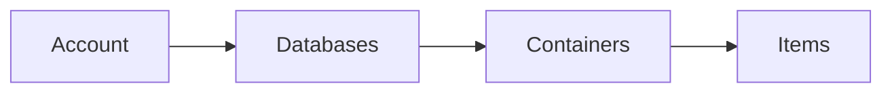

[](https://github.com/joerivanarkel/AzureCosmosDB/actions/workflows/dotnet.yml) <br>
**Contents:** <br>
[1. Working with Cosmos DB](https://github.com/joerivanarkel/AzureCosmosDB/edit/master/README.md#working-with-cosmos-db)<br>
[2. Creating a Database](https://github.com/joerivanarkel/AzureCosmosDB/edit/master/README.md#creating-a-database)<br>
[3. Creating a Container](https://github.com/joerivanarkel/AzureCosmosDB/edit/master/README.md#creating-a-container)<br>
[4. Sending a Item to a Container](https://github.com/joerivanarkel/AzureCosmosDB/edit/master/README.md#sending-a-item-to-a-container)<br>
[5. Querying a Item from the Container](https://github.com/joerivanarkel/AzureCosmosDB/edit/master/README.md#querying-a-item-from-the-container)<br>

# Azure Cosmos DB
Azure Cosmos DB is a no SQL database. As shwon in the underlying diagram, the top level is a Cosmos DB Account. Form here you can manage the Functions triggers, Connections and Settings. A Cosmos DB Account contains Databases, which is an organization of containers. In a Container you find the Procedures, User Defined Functions and Triggers. Most importantly a Container contains Items. A item ia a entity in the Contianer, which contains the identifiers, partition key and body of information.



## Working with Cosmos DB

Working with Cosmos DB is done through the CosmosClient from the `Microsoft.Azure.Cosmos` package. Using this i call the `GetDatabase()` and the `GetContainer()` methods to fill these variables. In the constructor i call for the strings: DatabaseId, the name of the Database, ContainerId, the name of the container, and the Connectiobstring, to connect to the Cosmos DB Account.

```csharp
private CosmosClient _cosmosClient;
private Database _database;
private Container _container;

public CosmosDbRepository(string databaseId, string containerId, string connectionString)
{
  _cosmosClient = new CosmosClient(connectionString);
  _database = GetDatabase(databaseId, _cosmosClient);
  _container = GetContainer(containerId, _database);
}
```

## Creating a Database

Firstly i try to get the databse from Azure, with the name of the database. If that returns null, i use the `CreateDatabaseIfNoxExistsAsync()` method to try to create the specified database through the CosmosClient.

```csharp
Database database = cosmosClient.GetDatabase(databaseId);
if (database.Equals(null))
{
  cosmosClient.CreateDatabaseIfNotExistsAsync(databaseId);
}
```

## Creating a Container

Similar to the Database, I try to fecth the container from Azure. When that returns null I try to create the container, but with this method I have to specify the partitionkeypath for the `CreateDatabaseIfNoxExistsAsync()` method. These methods aren't used with the CosmosClient, but the databse we previously created.

```csharp
Container container = database.GetContainer(containerId);
if (container.Equals(null))
{
  database.CreateContainerIfNotExistsAsync(containerId, "/id");
}
return container;
```

## Sending a Item to a Container
Firstly I try to check if the specified item doesn't already exists in the Container and throughout this method I log events through the console. If the exception returns `HttpStatusCode.NotFound` I try to create a item in the container. When all these fail we throw an exception.

```csharp
try
{
  ItemResponse<Entity> entityResponse = await _container.ReadItemAsync<Entity>(entity.id, new PartitionKey(entity.id));
  Console.WriteLine($"Item in database with id: {entityResponse.Resource.id} already exists");
  return true;
}
catch (CosmosException ex) when (ex.StatusCode == HttpStatusCode.NotFound)
{
  ItemResponse<Entity> entityResponse = await _container.CreateItemAsync<Entity>(entity, new PartitionKey(entity.id));
  Console.WriteLine($"Created item in database with id: {entityResponse.Resource.id}");
  return true;
}
catch
{
  Console.WriteLine("Failed to create item in database.");
  return false;
}
```

## Querying a Item from the Container

I query an item from the container using LINQ with cosmos from the `Microsoft.Azure.Cosmos.Linq` package. To use a LINQ query I first must get a Queryable, using the `GetItemLinqQueryable<T>()` method. Then I specify the linq query ans send the result to the Iterator. From here I fristly check if the Iterator has results and if the count isn't zero. Then I log the response adn return.

```csharp
var queryable = _container.GetItemLinqQueryable<Entity>();
var iterator = queryable.Where(p => p.id == id.ToString()).ToFeedIterator();
if (iterator.HasMoreResults)
{
  FeedResponse<Entity> response = await iterator.ReadNextAsync();
  if (response.Count != 0)
  {
    foreach (Entity entity in response)
    {
      Console.WriteLine($"Read item {entity.id} from database");
      Console.WriteLine($"    Body: {entity.Body}");
    }
    return response;
  }
  else
  {
    Console.WriteLine("No item found in database\n");
    return null;
  }
}
return null;
```
